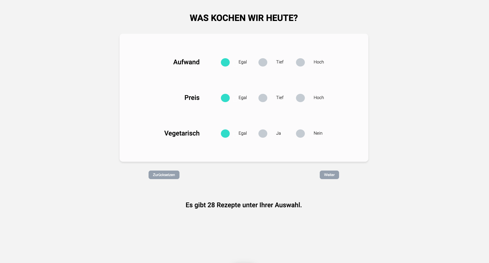
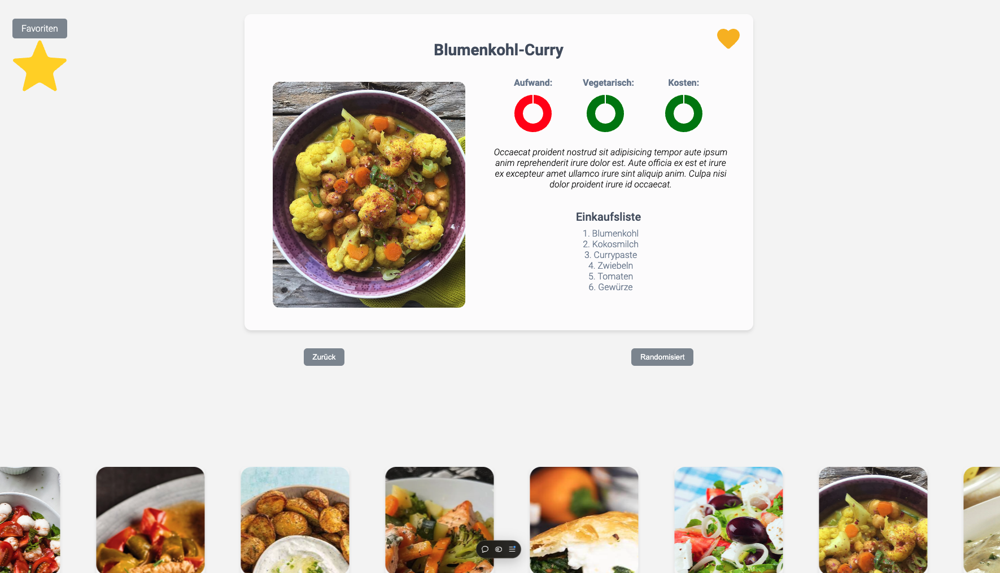
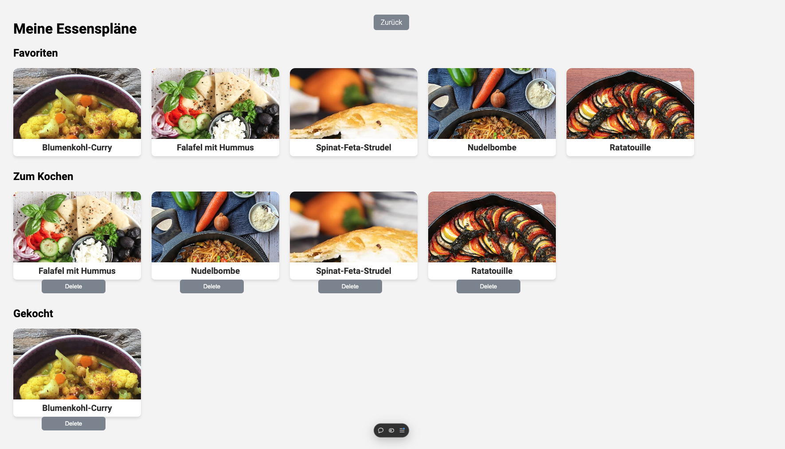

# Food Help App

Welcome to the **Essen App**! This application helps users find recipes based on their selected criteria, including effort, cost, and vegetarian options. Add them to your favorites and mark them as to cook or cooked.

## Features

- **Effort**: Choose recipes based on the amount of effort required.
- **Cost**: Filter recipes by their cost.
- **Vegetarian**: Select whether you want vegetarian recipes.

## Demo

You can view a live demo of the application at: [https://challenge-vue-expanded.vercel.app/](https://challenge-vue-expanded.vercel.app/)

## Screenshots

Here are some examples of what the app looks like:

### Example 1: Recipe Overview

### Example 2: Recipe Details

### Example 3: Favorite Details

## Usage

    - Select Criteria: Use the filters to choose recipes based on effort, cost, and whether they are vegetarian.
    - View Recipes: Browse the list of recipes that match your criteria.
    - Recipe Details: Click on a recipe to view more details, including ingredients and cooking instructions.

### Contributing

If you want to contribute to the project, follow these steps:

    - Fork the repository.
    - Restore Node Modules
    - Create a new branch (git checkout -b feature-branch).
    - Make your changes.
    - Commit your changes
    - Push to the branch
    - Open a pull request.
